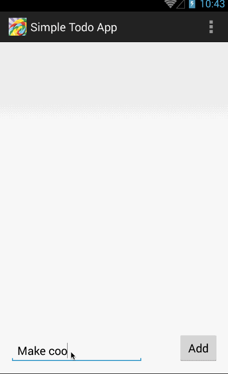

Simple To-Do List for Codepath
=========================

# Completed User Stories

## Required

- [x] Adding a to-do item
- [x] Removing a to-do item
- [x] Editing a to-do item
- [x] Persistence of changes across launches

## Optional

- [x] Disallow adding empty to-do items
- [x] Disallow editing a to-do item to become empty
- [x] Save to-do items in SQLite
- [x] Support due dates for each to-do item
- [x] Style each to-do item with a custom adapter
- [x] Use a DialogFragment for the editing UI

# Walkthrough of All User Stories

GIF created with [LiceCap](http://www.cockos.com/licecap/).
